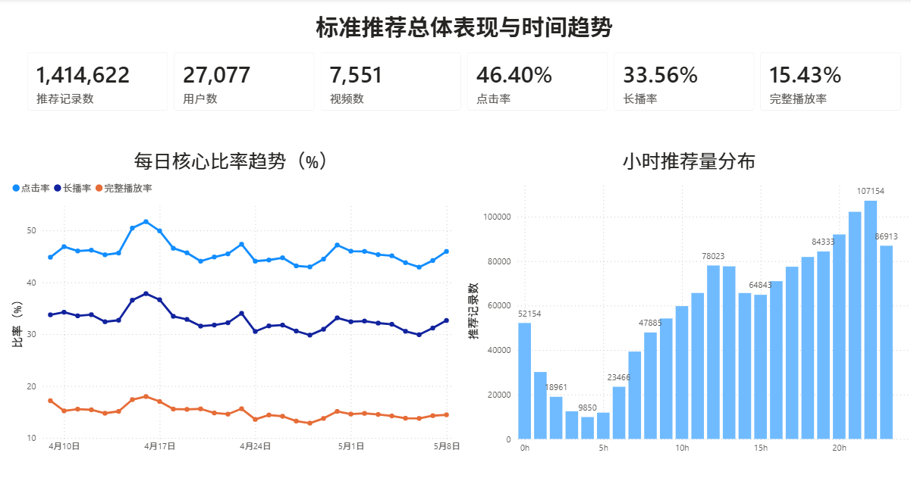
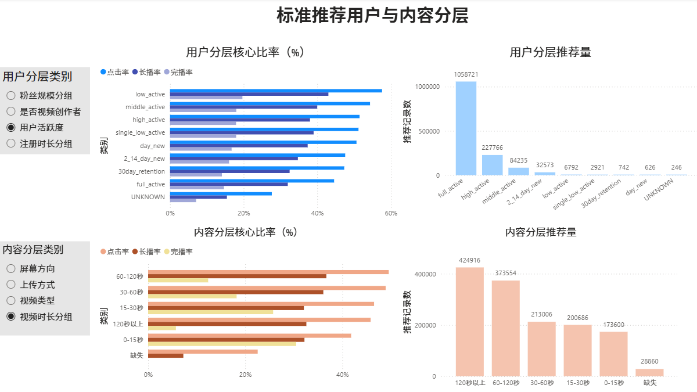
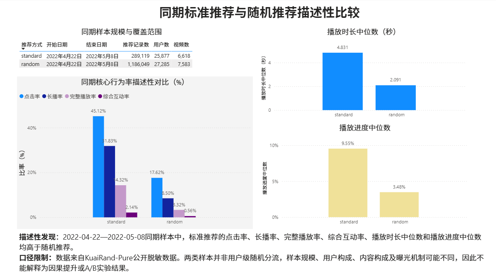

# KuaiRand-Pure 推荐行为分析

基于 **KuaiRand-Pure 公开脱敏数据**完成的端到端数据分析项目，覆盖 Python 数据清洗与质量审计、MySQL 指标建模、Power BI 可视化以及业务结论表达。项目面向数据分析、数据运营和业务分析岗位作品集展示。

> 数据说明：本项目使用公开脱敏数据，不包含企业实习或真实生产环境数据。标准推荐与随机推荐仅做同期历史样本的描述性比较，不构成用户级随机分流的 A/B 实验，也不支持因果结论。

## 数据来源与许可

- 官方项目：[chongminggao/KuaiRand](https://github.com/chongminggao/KuaiRand)
- 官方数据下载：[Zenodo 记录 10439422](https://zenodo.org/records/10439422)
- 参考论文：Gao et al., *KuaiRand: An Unbiased Sequential Recommendation Dataset with Randomly Exposed Videos*, CIKM 2022（[DOI](https://doi.org/10.1145/3511808.3557624)）

为便于面试官直接查看和复现，本仓库收录本项目实际使用的 5 个 KuaiRand-Pure 原始 CSV；这不是官方完整文件包，未使用的 `video_features_statistic_pure.csv` 不随仓库提供。原始数据内容保持不变，其权利与署名归原作者，使用和再分发时应遵循 KuaiRand 官方项目的 CC BY-SA 4.0 许可与引用要求。清洗后的 Parquet 和 MySQL 导入 CSV 可由项目代码重新生成，不纳入仓库。本项目的原创分析代码、文档和看板截图按根目录 [LICENSE](LICENSE)（CC BY-SA 4.0）发布。

## 项目概览

- 数据规模：标准推荐日志 1,414,622 条，覆盖 27,077 名用户和 7,551 个视频。
- 技术链路：`CSV → Pandas 清洗/审计 → Parquet → MySQL → 聚合视图 → Power BI`。
- 数据质量：完成重复日志、视频时长缺失、时间字段口径、跨表参照完整性以及“零播放却有互动”等检查。
- 指标体系：推荐规模、点击率、长播率、完整播放率、综合互动率、播放时长中位数与播放进度中位数等。
- 看板结构：总体与趋势、用户与内容分层、推荐方式同期描述性比较。

## 关键结果

标准推荐全量样本的点击率为 **46.40%**、长播率为 **33.56%**、完整播放率为 **15.43%**。点击率明显高于深度观看和互动指标，因此项目采用“开始播放—观看质量—深度互动”三层指标，而不是只看点击率。

在共同的 2022-04-22 至 2022-05-08 期间，标准推荐样本的点击率、长播率、完整播放率和综合互动率分别为 **45.12% / 31.83% / 14.32% / 2.14%**，随机推荐样本分别为 **17.62% / 8.50% / 3.32% / 0.56%**。这些结果只能表述为同期样本差异；两类样本的规模、用户构成、内容构成和曝光机制可能不同。

用户与内容分层显示，不同人群和内容形态的优势指标不同。例如，中低活跃用户在当前样本中的单位曝光效率较高，但样本量远小于高活跃用户；短视频更容易完整播放，中等时长内容在点击和长播方面更突出。所有分层结论都需结合样本量和指标分母解释。

## Power BI 看板

### 1. 总体与趋势



### 2. 用户与内容分层



### 3. 推荐方式同期描述性比较



## 项目结构

```text
KuaiRand_Pure/
├─ README.md
├─ LICENSE
├─ Python/                  # 7 个可复现 Notebook
├─ sql/                     # 建库、建表、导入、质检、分析视图与指标视图
├─ powerbi/
│  ├─ 可视化看板.pbix
│  └─ screenshots/
├─ docs/
│  ├─ 字段字典.md
│  └─ 指标口径.md
└─ data/
   ├─ raw/                  # 项目实际使用的 5 个官方原始 CSV
   └─ README.md             # 数据来源、目录、许可与引用说明
```

## 复现顺序

1. 按 [data/README.md](data/README.md) 准备公开数据文件。
2. 安装 Python 依赖：`pip install -r requirements.txt`。
3. 依次运行 `Python/01` 至 `Python/07`，生成清洗 Parquet 与 MySQL 导入 CSV。
4. 按 [sql/README.md](sql/README.md) 的顺序运行 `sql/01` 至 `sql/07`。
5. 使用 Import 模式连接 MySQL 数据库 `kuairand_analytics`，加载六张 `vw_metric_*` 视图并刷新 Power BI。

Notebook 会从当前目录向上自动寻找包含 `Python/` 和 `data/` 的项目根目录，因此既可以从项目根目录运行，也可以从 `Python/` 目录运行。MySQL 的 `LOAD DATA LOCAL INFILE` 需要本地绝对路径，若项目移动，请同步修改 `sql/03_load_data.sql` 中的四个 CSV 路径。

## 口径与限制

- `*_rate_pct` 在 SQL 中已乘以 100；Power BI 只追加 `%` 显示符号，不再乘以 100。
- 完整播放率与播放进度只对视频时长有效的记录计算。
- 预聚合比率不能跨分组直接求和，也不能用每日率的简单平均代替总体率。
- 公开脱敏 ID 与匿名标签只用于关联或分组，不推断真实身份、隐私属性或内容主题。
- 本仓库包含项目实际使用的 5 个官方原始 CSV，但不包含未使用的官方文件、清洗 Parquet 或 MySQL 导入 CSV。

## 延伸材料

- [字段字典](docs/字段字典.md)
- [指标口径](docs/指标口径.md)
